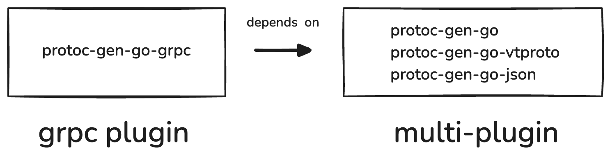

# bsr-sdk-multi-example

This repository contains an end-to-end example of how to:

1. Build a multi-plugin Docker image.
2. Upload to the Buf Schema Registry (BSR).
3. Build a second plugin Docker image.
4. Upload the second plugin to the BSR and create a dependency on the first plugin for use with
   Generated SDKs.

The goal is to end up with a custom Go "base plugin" that includes helper plugins to extend the
functionality of the base plugin. And then create a second custom plugin, like go-grpc, that depends
on the base plugin.

Note, a multi-plugin bundles generators like `protoc-gen-go`, `protoc-gen-go-vtproto`, and
`protoc-gen-go-json` that output generated code to the same package and are packaged using:
https://github.com/bufbuild/tools/tree/7b00c24c/cmd/protoc-gen-multi

<p align="left">
  
</p>

## Step 1 - Build the multi-plugin Docker image

A multi-plugin Docker image contains multiple plugins that output generated code to the same
package.

- [`protoc-gen-go`](https://pkg.go.dev/google.golang.org/protobuf@v1.35.2/cmd/protoc-gen-go)
- [`protoc-gen-go-vtproto`](https://pkg.go.dev/github.com/planetscale/vtprotobuf/cmd/protoc-gen-go-vtproto)
- [`protoc-gen-go-json`](https://pkg.go.dev/github.com/mfridman/protoc-gen-go-json)

See [multi/Dockerfile](./multi/Dockerfile) for the Dockerfile.

```shell
docker buildx build \
    --platform linux/amd64 \
    -f multi/Dockerfile \
    -t bufbuild.internal/custom-plugins/go:v1.35.2 \
    ./multi
```

Although there are multiple plugins in the image, the version is set to `v1.35.2` to match the
version of `protoc-gen-go`. You can set the version to any value you like.

## Step 2 - Upload the multi-plugin Docker image to BSR

Pick an organization and plugin name.

Avoid using `protocolbuffers` as an organization name as it is reserved for plugins that are
automatically synced by the system.

For the sake of this example, we'll use `custom-plugins` as the organization and `go` as the plugin
name.

Prepare a `buf.plugin.yaml`, see [buf.plugin.yaml](./multi/buf.plugin.yaml) for an example.

Make sure you have the `buf` CLI installed and authenticated with the BSR.

Either replace the remote address in the config file or use the `--override-remote=bsr.example.com`
flag.

```shell
buf beta registry plugin push \
    --visibility public \
    --image bufbuild.internal/custom-plugins/go:v1.35.2 \
    ./multi
```

## Step 3 - Build the second plugin Docker image

Prepare a Dockerfile that bundles the `protoc-gen-go-grpc` plugin, note there is a patch that is
applied to the plugin to force generated code to **output to a different package**, which is not the
default behavior. But it's what allows the BSR to create dependencies between the two plugins,
resulting in separate Go modules.

- [`protoc-gen-go-grpc`](https://pkg.go.dev/google.golang.org/grpc/cmd/protoc-gen-go-grpc@v1.5.1)

See [go-grpc/Dockerfile](./go-grpc/Dockerfile) for the Dockerfile.

```shell
docker buildx build \
    --platform linux/amd64 \
    -f go-grpc/Dockerfile \
    -t bufbuild.internal/custom-plugins/go-grpc:v1.5.1 \
    ./go-grpc
```

## Step 4 - Upload the second plugin Docker image to BSR

For simplicity, we'll use the same organization as the first plugin, `custom-plugins`, and the
plugin name `go-grpc`.

Avoid using `grpc` as an organization name as it is reserved for plugins that are automatically
synced by the system. We also don't want to modify this plugin because it has a dependency on
`protocolbuffers/go`.

Prepare a `buf.plugin.yaml`, see [buf.plugin.yaml](./go-grpc/buf.plugin.yaml) for an example.

```shell
buf beta registry plugin push \
    --visibility public \
    --image bufbuild.internal/custom-plugins/go-grpc:v1.5.1 \
    ./go-grpc
```

## Notes

### Installing the `buf` CLI from source

We're using `main` to include unreleased features.

```shell
go install github.com/bufbuild/buf/cmd/buf@main
```
